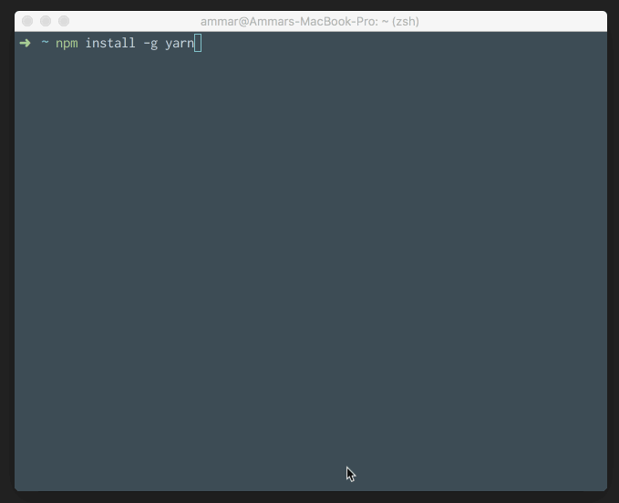

Have you ever get annoyed that `npm install` or `npm update` taking too much time, even after you already executed the same command 2 minutes ago?

Never mind that, you’ll never face that delay again.

Meet your savior, [Yarn](https://yarnpkg.com)!

Yarn has been developed by Facebook, it has better algorithms for getting the dependencies and it uses a lock file for keeping track of each one.

Check out this article for a cheat sheet comparing npm vs yarn commands:

[https://shift.infinite.red/npm-vs-yarn-cheat-sheet-8755b092e5cc#.35o6e2rs1](https://shift.infinite.red/npm-vs-yarn-cheat-sheet-8755b092e5cc#.35o6e2rs1)

To move completely to Yarn, you can add an alias to your `~/.zshrc` (bashrc or fishrc depending on your shell).

`alias npm=yarn`

So if you forget and run npm, you’ll be using yarn instead.

Note that if you’re using nvm or starting up the shell using some npm commands it might break, do the alias part if you’re not starting up the shell with npm commands.

For more information, checkout [Yarn Docs](https://yarnpkg.com/en/docs/).
