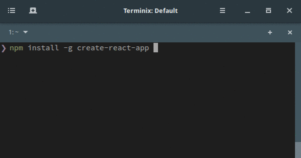

When you try to get your hand dirty to learn something, it’s disappointing how hard it’s to start.

It was like this with React, you find a lot of ways to start a new react project. some use WebPack some suggest Gulp and some just use CDN scripts to ignore the build step to see some fast result.

That was the case until yesterday (22 July 2016) when Facebook [announced](https://facebook.github.io/react/blog/2016/07/22/create-apps-with-no-configuration.html) a new npm package. They call it “[create-react-app](https://github.com/facebookincubator/create-react-app)”, with the description: Create React apps with no build configuration.

### Usage

Open your terminal and run:

> npm install -g create-react-app

This will install the package globally on your system. Then use the package to initiate a new project, let’s call it “react-hello-world”.

> create-react-app react-hello-world

Then you’re ready to get your hands dirty! “_cd_” into the new project’s folder and start hacking.

### Behind the scenes

The first impression you can get is that this tool doesn’t use a build tool or anything, just pure npm scripts.

This tool uses WebPack and Babel under the hood. It even uses ESLint to lint the code while watching it for changes, and show the warnings/errors in the terminal. so keep an eye on it while developing!
