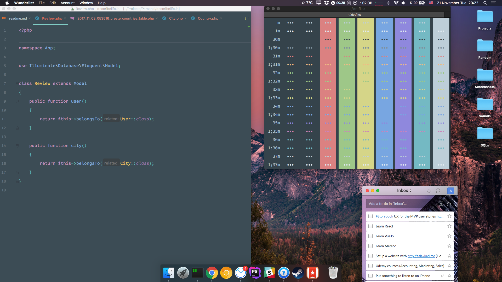
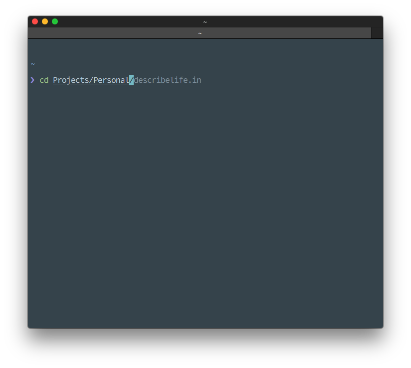
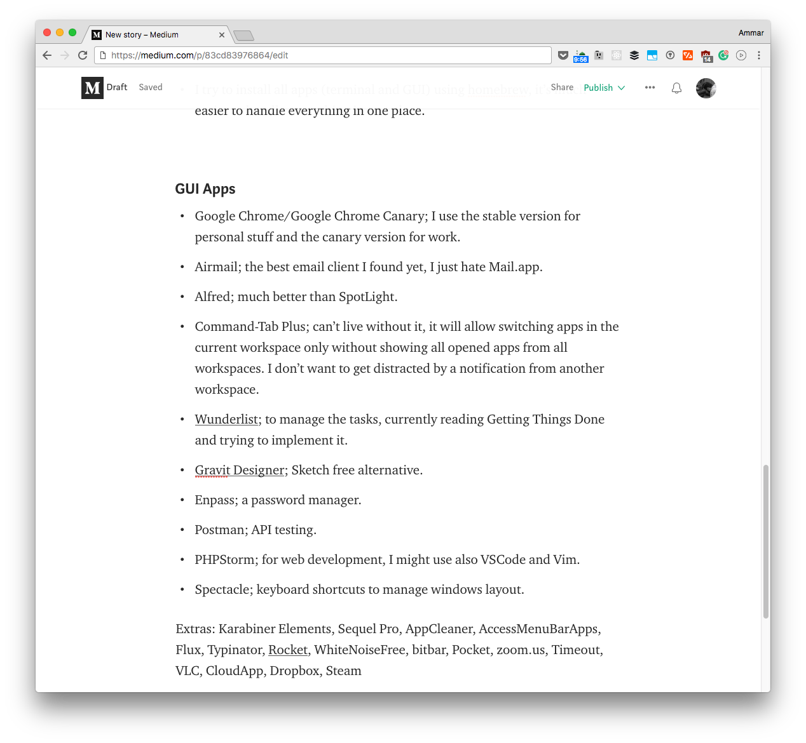
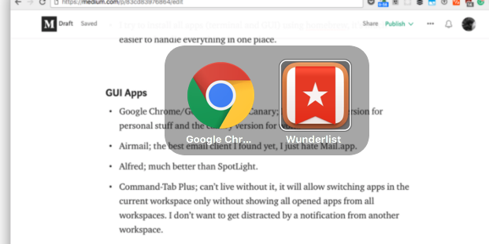
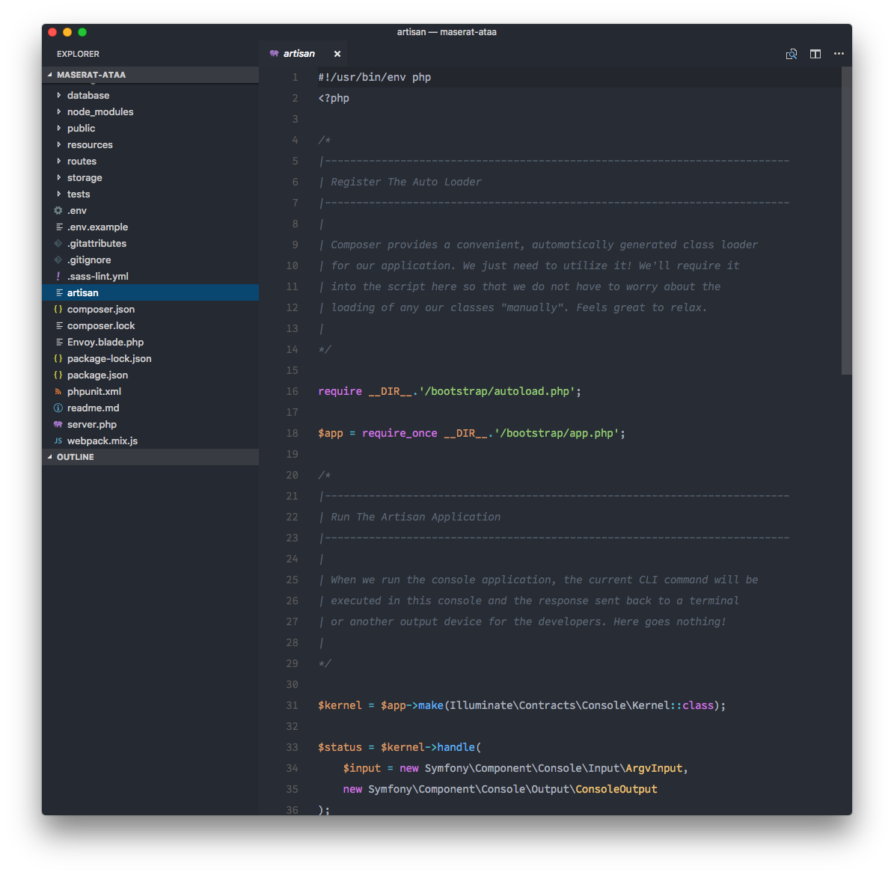

I might have changed my setup a million times already, but this is how it looks now. Hope you find something useful ☕️

The content is divided on 3 sections:

-   Hardware
-   Software
-   Screenshots 📷

### Hardware

I’m using MacBook Pro early 2015 beside an external monitor [Dell P2317H](http://amzn.to/2zcGoyU) 23", I close the laptop all the time and use the external monitor primarily.

I’ve an [Apple Wired Keyboard](http://amzn.to/2z8tGRS) and a [Logitech MX Master](http://amzn.to/2zXBsS4) mouse, I find it much better than [Apple Magic Mouse](http://amzn.to/2iE0USX), except for the battery life!

### Software

#### Terminal

[iTerm2](https://www.iterm2.com/), [Nova colorscheme](https://trevordmiller.com/projects/nova), [Office Code Pro](https://github.com/nathco/Office-Code-Pro) font (I won’t buy [Operator Mono](https://www.typography.com/fonts/operator/overview/) for $200!), Zsh, [Oh-my-zsh](https://github.com/robbyrussell/oh-my-zsh) and [pure prompt](https://github.com/sindresorhus/pure).

#### System

-   I’ve the dock hidden to have more space on screen and reduce distraction by seeing badges, if there’s a notifications I tend to check them.
-   I try to install all apps (terminal and GUI) using [homebrew](https://brew.sh), it’s much easier to handle everything in one place.

#### GUI Apps

-   [Google Chrome](https://www.google.com/chrome/browser/desktop/index.html)/[Google Chrome Canary](https://www.google.com/chrome/browser/canary.html); I use the stable version for personal stuff and the canary version for work.
-   [Airmail](https://airmailapp.com); the best email client I found yet, I just hate Mail.app.
-   [Alfred](https://www.alfredapp.com); much better than SpotLight.
-   [Command-Tab Plus](http://commandtab.noteifyapp.com/); can’t live without it, it will allow switching apps in the current workspace only without showing all opened apps from all workspaces. I don’t want to get distracted by a notification from another workspace.
-   [Wunderlist](https://www.wunderlist.com); to manage the tasks, currently reading Getting Things Done and trying to implement it.
-   [Gravit Designer](https://www.designer.io/); Sketch free alternative.
-   [Enpass](https://www.enpass.io/); a password manager.
-   [Postman](https://www.getpostman.com); API testing.
-   [PHPStorm](https://www.jetbrains.com/phpstorm); for web development, I might use also VSCode and Vim.
-   [Spectacle](https://www.spectacleapp.com); keyboard shortcuts to manage windows layout.

Extras: Karabiner Elements, Sequel Pro, AppCleaner, AccessMenuBarApps, Flux, Typinator, [Rocket](http://matthewpalmer.net/rocket/), WhiteNoiseFree, bitbar, Pocket, zoom.us, Timeout, VLC, CloudApp, Dropbox, Steam

### Screenshots

---

That’s it, hope you find something interesting that might implement on your machine :)
