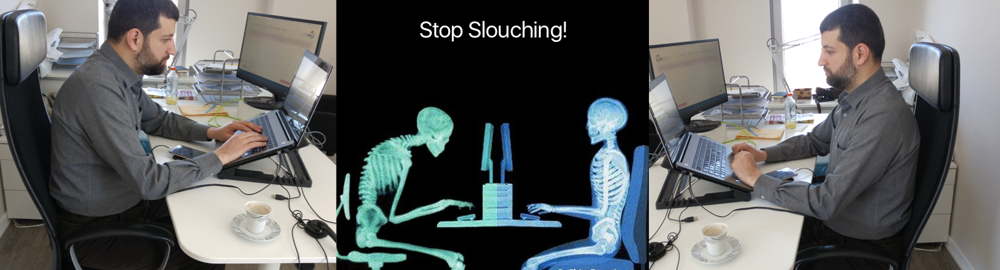
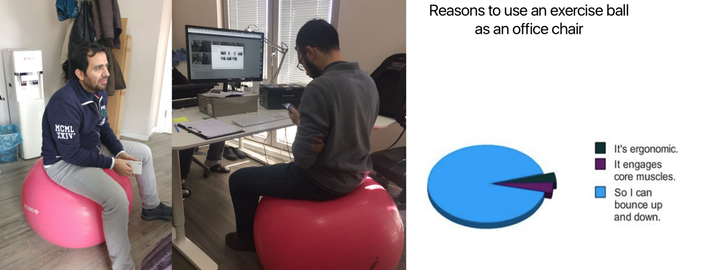
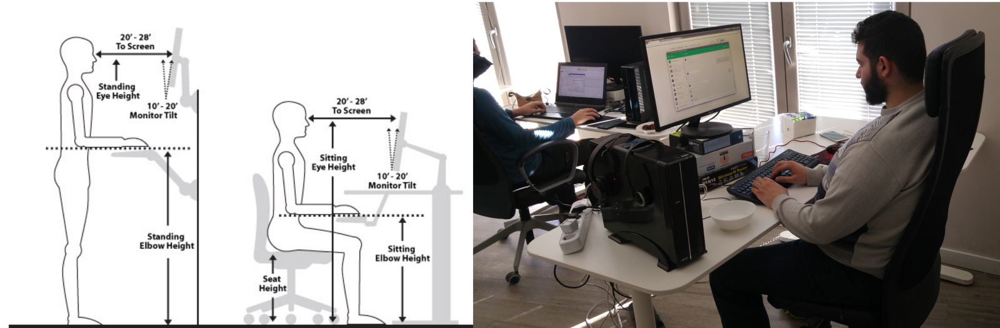
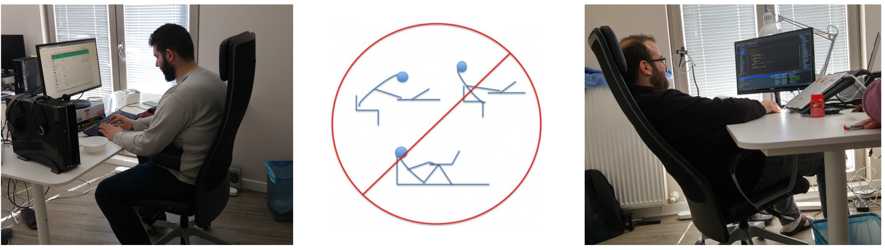

Are you slouching in front of your computer right now?

### What is posture and why should you care ?

Posture refers to the way you hold your body while sitting or standing. Did you know that just sitting for long periods can cause numerous injuries and strain to your body? Did you know it can even lead to early death?

### Some consequences associated with sitting for too long

1.  You burn less calories because your metabolism slows down— leading to more **stored fat in your body**
2.  It increases your risk of **Diabetes** and **Heart Disease**
3.  It could result in **Chronic Pain** of the lower back, neck and shoulder — which could cause low quality sleep and insomnia
4.  Sitting for long periods and leading a sedentary life is linked to **Early Death**

Allah (SWT) said:

> _{وَلَا تُلْقُوا بِأَيْدِيكُمْ إِلَى التَّهْلُكَةِ}_

“and do not throw yourselves with your own hands into destruction” (Aya: 195 — Al-Baqara)

We care about our bodies, because it’s Amanah, and we have to take care of that Amanah.

### Tips to consider

If the most part of your day consists of sitting in front of a computer, or in meetings, your health may be suffering. There are things you can do to improve your health and decrease the risks associated with this problem.

-   Use **exercise balls** instead of normal chairs for periods during the day
-   Take the **stairs** instead of elevator whenever you can.
-   **Take a break** from your desk every 30–40 minutes and walk for 2–4 minutes.
-   Have **standing desks** available in the office.

-   Have **Walking meetings.**
-   Install a program that reminds you to take a break and/or exercise, e.g. [**Time out**](http://www.dejal.com/timeout/)**,** [**Workrave**](http://www.workrave.org/).
-   Manage your screen, light, chair, keyboard and mouse placement.
-   Use a laptop with an **external keyboard and mouse**.
-   Don’t cross your legs when sitting.
-   Use a chair with **lumbar support**.
-   Do **periodic stretching exercises** with resistance bands or horizontal pull up bars.
-   Remember to **consciously correct your posture** when sitting or standing.

You can’t get rid of the need to sit for long periods of time altogether, but periodic stretching and paying conscious attention to the way you carry your body can mean a world of difference.

#### References

-   [Staying Active At Work Will Improve Your Health (VIDEO) | The Huffington Post](http://www.huffingtonpost.com/2012/07/31/dangers-of-sitting-too-long-stay-active-at-work_n_1723732.html)
-   [Sit Less, Stand More: Your Health Depends On It | The Huffington Post](http://www.huffingtonpost.com/leslie-spry-md-facp/sitting-health_b_1929759.html)
-   [Why Sitting Too Much Is Seriously Bad for Your Health](https://authoritynutrition.com/why-sitting-is-bad-for-you/)
-   [http://www.sittingsolution.com/special/?pub=240083&hit=391386550](http://www.sittingsolution.com/special/?pub=240083&hit=391386550)
-   [Office Habits for the Fit Nerd | NEAT STRENGTH](http://neatstrength.com/fit-nerd/)
-   [5 Ways to Correct Desk Posture and Set up an Ergonomically Correct Desk](http://www.benharoffice.com/5-ways-to-correct-desk-posture-and-set-up-an-ergonomically-correct-desk/)
-   [http://fitness.mercola.com/sites/fitness/archive/2015/05/08/sitting-too-long.aspx](http://fitness.mercola.com/sites/fitness/archive/2015/05/08/sitting-too-long.aspx)
