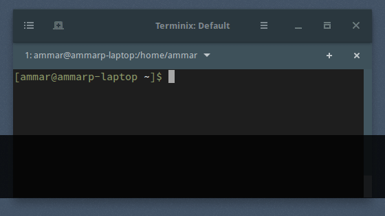

Sometimes it’s handy to go the beginning of the line, maybe you want to add a forgotten “sudo”? or to move to the end of the line to add some arguments?

To navigate to the beginning of the line in use: “CTRL+a”.  
To navigate to the end of the line in use: “CTRL+e”.

**Hint**: the shortcuts works on most of the applications inside the terminal, like Vim, Emacs and others.
